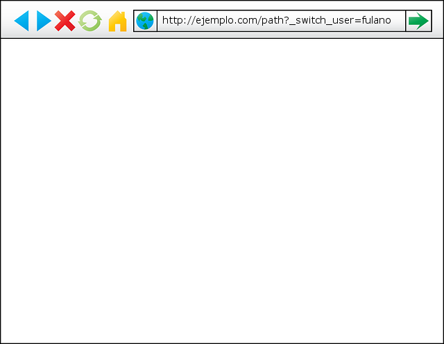
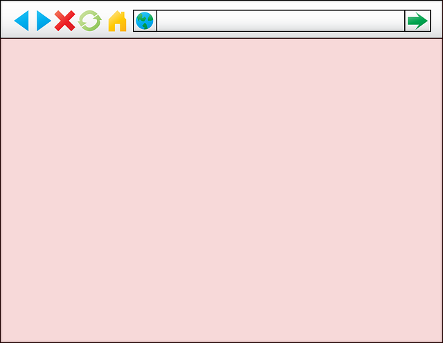

Fichero security.yml
=======

Existens ficheros específicos para los entornos de [producción](SECURITY_PROD.md) y [desarrollo](SECURITY_DEV.md). 

## Imitar usuarios
 
**Advertencia**: la imitación de usuarios puede ser muy peligrosa y provocar errores severos.
```
security:
    firewalls:
        main:
            # ...
            switch_user: true
```


**Es conveniente dar alguna pista visual de que se está impersonando a un usuario**. Por ejemplo:
```
<body class="  impersonating  ">
 
 .impersonating { background: rgba(204, 0, 0, 0.15); } 
```



